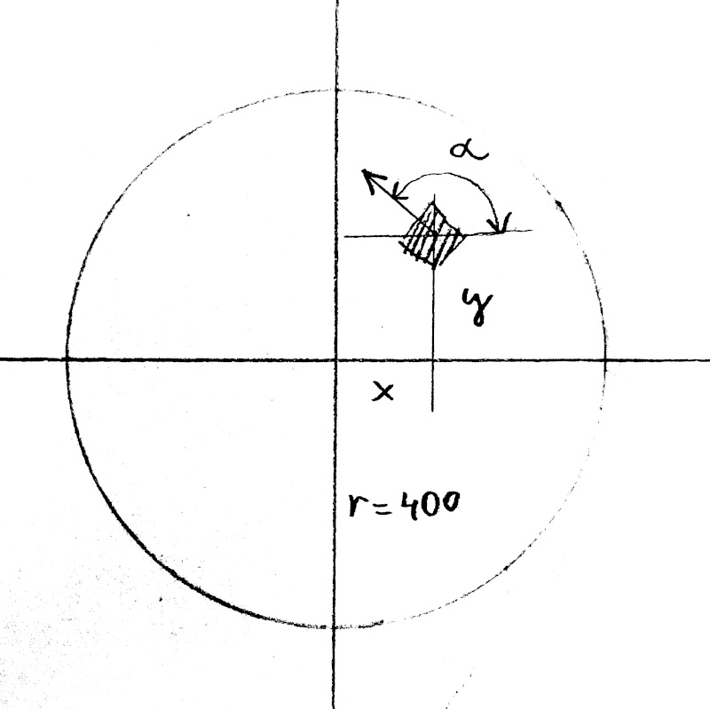

sumosim
=======

Simulation environment for sumo robots

## Prerequisites
Before you can use sumosim you have to check out the sbt project doctus at https://github.com/wwagner4/doctus. 
Build doctus using 'sbt publish-local' before you build sumosim

## Development with sbt
To build sbt use `sbt compile`

To run on the JVM call `sbt sumosimJVM / "run --help"`

The JS environment is currently work in progress.  

## Package JVM
In sbt select project 'sumosimJVM'

There execute

`pack`

This will create a distribution in sumosim/jvm/target/pack 

There you can call

`bin/sumosim --help`

## Arena

The arena is a circle with a radius of 400. All distance values
of the sensors refer to that value.

Collisions of robots is managed by the arena. Two robots collide if their distance is smaller than 100.

## Robots
### Differential drive
A robot with two wheels. Each wheel is powered by a motor that can spin forward or backward.

The values for the motors are between -max (backward) and + max (forward). max should be 
around 50

## Sensors
### Null Sensor
The sensor provides no values.

### Opponent Fan
Shows if an opponent is in sight.

### Border Distance
Indicates distance of the arena's border in front of the robot

### Extended Border-Distance
The extended border distance sensor offer in addition to the border
distance the current position and direction of the robot itself.

### T-Border-Distance
Indicates the distance to the border of the arena to the left, in front
and to the right. 

### Combi
Opponent Fan with T-border distance

## TODOs Doctus

 - Remove the current Select Interface and replace it by Select1
 - Rename DoctusComponentFactory to DoctusCanvasSwingFactory 
 - Remove double buffering from DoctusComponentFactory
 - Add   System.setProperty("sun.java2d.opengl", "true") when creating a canvas
 - Make DoctusSelectSwingComboBox a case class. Check for other implementations that could also be case classes.
 - Done ? Also support DoctusImageAwt in DoctusGraphicsSwing (104ff), or remove DoctusImageAwt
 - DoctusSelectSwingComboBox as case class
 - remove all font size and font from from swing components